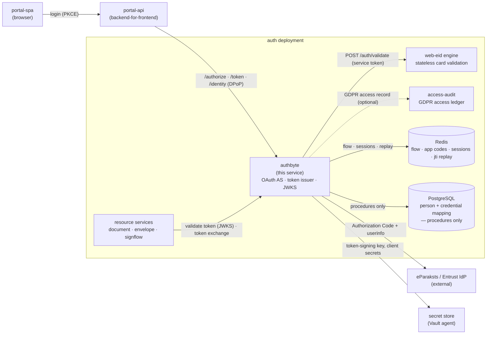
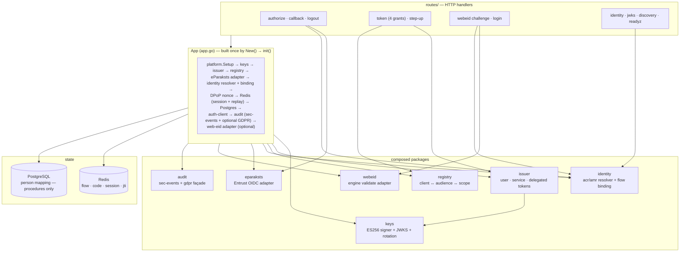

# authbyte

The **identity and authentication authority** of the eSignature portal — the OAuth 2.0 Authorization Server (RFC 6749) the whole fleet trusts to say *who a caller is*. It brokers login against the Latvian eID identity providers, resolves each login to one stable person subject, and mints short-lived, **DPoP sender-constrained** (RFC 9449) JWT access tokens (RFC 7519) that every other service validates against this issuer's published keys.

It is the only service that talks to the upstream identity providers, and the only one that holds the token-signing key. Everything downstream is a *relying party* on the tokens it issues: services never authenticate users themselves — they validate a token minted here and trust its `sub`, `loa`, `login_method`, and `cnf.jkt` claims. That trust boundary is the point of the service — authentication is centralised so the signing flows, the portal API, and the audit services can stay stateless about *how* someone logged in.

It resolves a login to a **person**, not to a credential: the same human authenticating by eParaksts Mobile one day and a Web eID card the next — different upstream subjects — maps to one internal subject, keyed on the eIDAS national identity code. It also carries a **login-method to signing-flow binding**: the method someone logged in with determines which signing flows their token may later drive, so a signature can only be produced by a login strong enough to authorise it.

It renders no human UI (a bundled static demo aside, off in production). Its surface is OAuth/OIDC-shaped for the browser SPA and its backend-for-frontend, plus a token endpoint used server-to-server by the rest of the fleet. Built on [`azugo.io/azugo`](https://azugo.io); module `github.com/go-make-bytes/authbyte`.

---

## Where it sits

`authbyte` is the hub of the fleet's auth. The browser SPA (`portal-spa`) begins login through its backend-for-frontend (`portal-api`); this service drives the Authorization Code flow against **one configured upstream OIDC provider** — the **eParaksts / Entrust** identity provider in this deployment, or any standard OIDC provider via the generic connector (see Configuration) — or, for eID smart cards, calls the **web-eid** engine's stateless validation. It resolves the login to a person in the shared PostgreSQL, keeps transient flow and session state in Redis, and issues tokens signed with a key held only here. Downstream resource services (document, envelope, signflow, notification, …) never see the identity provider — they validate the issued token and, when acting for a user, obtain an on-behalf-of token back from this same `/token` endpoint (RFC 8693 token exchange).



Division of labour: `portal-api` owns the browser session cookie and proxies the SPA's requests; `authbyte` owns the authentication verdict, the person mapping, and every token the fleet honours; the **web-eid** engine owns the cryptographic validation of a Web eID card token; **access-audit** owns the durable GDPR personal-data-access ledger; the **eParaksts / Entrust** identity provider owns the actual act of authenticating the human. The two seams that bite are the JWKS this service publishes (every relying party pins its trust to it) and the `login_method` claim (the signing services read it to decide whether a login may drive a given signing flow).

---

## Two supported modes

The service runs in one of two modes, selected by a single knob (`ROLEBYTE_URL`). Both are
first-class, supported configurations; neither is a degraded form of the other.

- **Standalone** (default — `ROLEBYTE_URL` empty): every authenticated person is minted the
  **static baseline scope set** and no `tenant` claim. Authentication is access: whoever the
  identity provider vouches for gets the baseline capabilities.
- **Register-backed** (`ROLEBYTE_URL` set): scopes and the `tenant` claim are resolved from the
  **membership register** at every user-token issue, and a person with **no membership is
  refused at token issue** — the register, not the login, grants access.

Choosing a mode is choosing that access-control behaviour. A single-product deployment that
admits anyone who can authenticate runs standalone; a multi-tenant deployment where an
organisation decides who belongs runs register-backed.

### The register boundary (`ScopeResolver` contract)

The seam between this authorization server and the membership register is one interface,
consulted at every user-token issue (first issue and refresh). The register and this service
ship separately, so this boundary is a published contract:

- **Question:** the authenticated person's identity code (serial number).
- **Answer:** the person's `group:level` scopes and their single tenant, both minted into the
  token verbatim.
- **Refusals are the register's to make and this service honours them:** no membership → the
  issue is refused with `403` `err:membership:notMember`; several memberships → refused with
  `409` `err:membership:ambiguous`, never guessed.
- **Unreachable register fails the issue closed** — `502` `err:upstream:unavailable`. An
  empty-scope or guessed-scope token is never minted.
- **Compatibility:** the contract evolves additively. A register that answers this contract
  keeps working across releases of either side; a change that would refuse tokens this
  contract allows is a breaking change and is versioned, not slipped in.

Every case above is pinned by a test (`routes/token_rolebyte_test.go`), including both modes'
happy paths.

---

## HTTP surface

Endpoints are registered in [`routes/router.go`](routes/router.go). The two optional surfaces — Web eID card login and the dev/demo helpers — are **registered only when configured**, so an unconfigured capability is absent, not merely disabled.

| Method + path | Purpose | Auth |
|---|---|---|
| `GET /authorize` | Begin user login (Authorization Code + PKCE, RFC 7636). Validates `redirect_uri` against the registered allowlist, saves flow state, redirects to the identity provider | anonymous |
| `GET /callback` | Handle the identity-provider redirect: exchange the code, read claims, resolve the person, establish a session, mint a single-use app authorization code | state-verified (path configurable) |
| `GET /logout` | Front-channel logout: delete the server session and, for federated logins, bounce the browser through the identity provider's logout so its SSO cookie is cleared, then to `redirect_uri` | anonymous (`redirect_uri` allowlisted) |
| `POST /token` | OAuth token endpoint — `authorization_code` \| `client_credentials` \| `refresh_token` \| `urn:ietf:params:oauth:grant-type:token-exchange`. Every hop requires a valid DPoP proof | PKCE / client secret / session / subject token — all + DPoP |
| `POST /step-up` | Re-authenticate with a stronger or different login method to satisfy a signing-flow binding; returns a redirect (federated methods) or a Web eID challenge | existing session |
| `GET /identity` | The internal identity plus `loa`, `login_method`, and the signing flows that method permits | valid user token (DPoP) |
| `GET /webeid/challenge` | Issue a Web eID challenge nonce and persist the flow (card login) | anonymous — **only if `WEBEID_ENGINE_URL` set** |
| `POST /webeid/login` | Validate the Web eID auth token via the engine, resolve the person, mint an app authorization code | anonymous — **only if `WEBEID_ENGINE_URL` set** |
| `GET /.well-known/jwks.json` | Signing public keys (active + retired-within-window) | anonymous |
| `GET /.well-known/openid-configuration` | Discovery metadata (endpoints, supported grants, `S256`, `ES256`) | anonymous |
| `GET /healthz` | Liveness — 200 whenever the process is up | anonymous |
| `GET /readyz` | Readiness (fail-closed) — 503 when Redis or PostgreSQL is unreachable, so the pod leaves rotation | anonymous |
| `GET /demo/{path}` | Static demo SPA, served same-origin so the browser can read the `DPoP-Nonce` header | **only if `DEMO_DIR` set** — development |

The `/metrics` VictoriaMetrics registry and standard tracing/logging are provided by the shared platform base (`go-platform-kit`), gated by `METRICS_ENABLED`; there are no service-specific custom metrics.

---

## Architecture

One application object (`App` in [`app.go`](app.go)) wires every dependency once at startup and **fails closed** on misconfiguration — a missing token-signing key without the explicit development opt-in stops the process from starting, as does an unparseable client registry or an invalid audit configuration. Cross-cutting concerns (structured logging + redaction, tracing, correlation) are installed exactly once by the platform library before any route is registered; nothing re-registers them.



Two libraries carry the reusable auth primitives so they are identical across every consumer: `go-authbyte` (DPoP verification, server nonce, jti replay, JWK thumbprints, the auth-client that guards `/identity` and mints outbound tokens) and the platform emitters (`go-sec-events`, `go-gdpr-audit`). The `eparaksts` package is the **only** code coupled to the concrete upstream identity provider — a new identity source is an alternate adapter behind the same `identity.Resolver`.

---

## Login and token lifecycle

The eParaksts redirect flow, from the SPA's PKCE challenge to a DPoP-bound user token. The Web eID card flow is the same shape with `/webeid/challenge` + `/webeid/login` replacing `/authorize` + `/callback`, and the engine call replacing the identity-provider round-trip.

```mermaid
sequenceDiagram
    participant SPA as portal-spa / portal-api
    participant AC as authbyte
    participant IDP as eParaksts IdP
    participant RD as Redis
    participant PG as PostgreSQL

    SPA->>AC: GET /authorize (PKCE challenge, client_id, redirect_uri)
    AC->>AC: validate redirect_uri against registry allowlist
    AC->>RD: SET flow:{state} (PKCE + client + redirect, TTL 10m)
    AC-->>SPA: 302 → IdP authorize URL
    SPA->>IDP: authenticate (eParaksts Mobile / eID Scan)
    IDP-->>AC: GET /callback?code&state

    AC->>RD: GETDEL flow:{state} (single use)
    AC->>IDP: exchange code → access token → /users/me
    AC->>AC: resolve acr+amr → login_method + loa
    alt method not permitted via IdP (sc_plugin → eid)
        AC-->>SPA: 403 (eID card must use Web eID)
    else permitted (mobileid / mobile-eid)
        AC->>PG: identity.upsert (person keyed on national id)
        AC-->>AC: GDPR access record (routine, fail-open)
        AC->>RD: SET sess:{sid} (session, TTL 12h)
        AC->>RD: SET code:{appCode} (bound to session + PKCE, TTL 60s)
        AC-->>SPA: 302 → redirect_uri?code&state
    end

    SPA->>AC: POST /token (grant=authorization_code, DPoP proof)
    AC-->>SPA: 401 use_dpop_nonce + DPoP-Nonce (first hop only)
    SPA->>AC: POST /token (+ server nonce, code_verifier)
    AC->>AC: verify DPoP + nonce + jti replay
    AC->>RD: GETDEL code:{appCode}; verify PKCE + client/redirect echo
    AC->>RD: bind session to DPoP thumbprint; save
    AC->>AC: issuer.IssueUser (cnf.jkt = thumbprint)
    AC-->>SPA: {access_token (DPoP), refresh_token = session id, capabilities?}
```

**Login-time signing capabilities.** When the upstream's userinfo carries a
sign-identity catalog (the eParaksts profile requests the sign-identity profile
scope by default), the login also captures the session's signing capabilities:
the signing identity the login method uses, its certificate, the paired
authentication certificate, and the organisation seals the person may sign with
(id + display label + certificate). A Web eID card login contributes the card's
own authentication certificate instead (seal availability stays unknown there).
The object is stored on the session and returned once, on the
`authorization_code` grant — a refresh is not a new identification and never
carries it. Everything about it is best-effort and optional: a failed fetch
leaves fields out, absent capabilities mean "unknown" rather than "none"
(`seals_known` marks a read catalog, so an empty seal list is authoritative),
and a signing service falls back to resolving identities itself when fields are
missing. Certificates carry personal data: they are never logged and die with
the session.

`refresh_token` is the server session id: a refresh re-issues a user token only when the caller presents the **same DPoP key** the session was bound to at code exchange, so a stolen refresh handle alone is useless.

---

## Identity resolution and the login-method binding

The `identity` package is the anti-corruption layer between the identity provider's (in-flux) authentication claims and the platform's stable model. `Interpret` scans **both** `acr` and `amr` against two explicit vocabularies (longest token wins), so it does not matter which claim the provider currently carries the method or level in — resolving stays correct as the upstream moves signals between the two claims; the only change a move needs is data, not control flow.

| Login method (`login_method`) | Recognised token | Assurance | Permitted signing flows | Status |
|---|---|---|---|---|
| `webEid` | (validated by the web-eid engine) | `high` | `webEid` | permitted (card login) |
| `eidScan` | `mobile-eid` | `high` | `eidScan` | permitted |
| `eparakstsMobile` | `mobileid` \| `smart_id` \| `cloud` | `high` | `eparakstsMobile`, `eparakstsMobileEseal`, `csc` | permitted |
| `eid` | `sc_plugin` \| `smartcard` | — | none | **rejected** — eID card must use Web eID |

The `login_method` value is one camelCase literal shared by name with the signing service, so a login and the signature it authorises correlate on a single token. The binding **fails closed**: an unknown or empty method — and the plugin `eid` path — permits nothing. Two independent guards enforce the "eID card is Web eID only" rule: the callback rejects a login that resolves to `eid` with 403 even if the identity provider's page offered it, and the built-in login-method policy never maps a bare `eid`. Assurance-level and method vocabularies can be overridden per environment (`LOA_POLICY`) once production's exact `acr` values are confirmed.

**Step-up** re-authenticates in place: it elevates the *existing* session rather than creating a new one, and enforces that the method actually achieved matches the one requested — so a user cannot "step up" to a stronger method yet authenticate with the old one and keep the binding unchanged.

---

## Tokens

All tokens are ES256 JWTs (RFC 7519) minted in `issuer/`, DPoP sender-constrained via the `cnf.jkt` confirmation claim (RFC 9449), and scoped to a single audience.

| Token | Grant | Subject | Carries |
|---|---|---|---|
| **User** | `authorization_code` / `refresh_token` | internal person subject | `scope`, `loa`, `login_method`, name parts, `serial_number`, `tenant` (membership deployments only), `cnf.jkt` |
| **Service** | `client_credentials` | client id | `client_id`, `scope`, `cnf.jkt` — scoped to one audience by the registry |
| **Delegated** | `token-exchange` (RFC 8693) | the end user named in the subject token | `scope`, `loa`, `login_method`, `serial_number`, `tenant` (carried forward), `act` (acting client), `cnf.jkt` |

In register-backed mode (`ROLEBYTE_URL` set), user tokens also carry the **`tenant`** claim — the single membership's organisation, resolved at every issue alongside the scopes. Multi-tenant resource services scope every operation by the token's tenant, never by request data, and token exchange carries it forward so delegation cannot strip it. Standalone deployments mint no tenant claim.

Token exchange lets a confidential client obtain an on-behalf-of token toward another service: the presented subject token must be one this issuer minted and still valid; a **service** subject cannot be impersonated (a service acting for a user stays distinct from a service acting as itself); the minted token names the user as `sub` (so downstream owner-filtering is identical to a direct user call) while recording the acting client in the `act` chain, and carries `login_method` + `loa` forward so the login-to-signing binding still applies downstream. The exchange audience and scopes are authorised against the same registry grant matrix as `client_credentials`.

---

## State and data model

**The service never touches database tables.** PostgreSQL access in [`store/postgres.go`](store/postgres.go) goes exclusively through `SECURITY DEFINER` stored procedures called with a uniform JSONB envelope (`CALL proc($1::jsonb, NULL::jsonb)` → `po_data`); the service connects with an `EXECUTE`-only role (`authbyte_public`) that has no direct table grants. The schema and the procedure logic are owned by the platform's separate `database` migration repo (one authored home per schema, shipped as one migration image) — this package only knows procedure *names* (`identity.upsert`, `identity.get`). A procedure that fails after a write re-raises a structured error (SQLSTATE `P0001`) whose message is the same envelope, so a validation failure and a post-write rollback surface identically.

The person is keyed on the eIDAS national identity code (`serial_number`, e.g. `PNOLV-...`): the same human across different auth methods — different upstream subjects — resolves to one internal subject. `identity.upsert` reports whether the person was *created* on this call (first-ever login) so the caller emits the correct GDPR event (created vs updated); linking a new method to a known person is an update.

Redis holds only short-lived auth-flow and session state (`session/`), every key TTL-bounded:

| Key | Value | TTL | Notes |
|---|---|---|---|
| `flow:{state}` | in-progress login (PKCE, client, redirect, step-up intent, Web eID nonce) | 10m | consumed with `GETDEL` (atomic single use) |
| `code:{appCode}` | app authorization code → session + PKCE | 60s | consumed with `GETDEL` (replay-safe) |
| `sess:{sid}` | user session (subject, loa, method, scopes, DPoP thumbprint, signing capabilities) | 12h | `sid` is the SPA's `refresh_token`; deleted on logout. Capabilities hold identity certificates (personal data) — session-bound by design, never logged |
| jti replay entries | seen DPoP proof ids | proof max-age + leeway | one-time-use guard for issuance proofs |

---

## Keys

A single **ES256** token-signing key, managed in `keys/`. In production it is loaded as a PEM from the secret store (`TOKEN_SIGNING_KEY`); with no key configured the service **refuses to start** unless `ALLOW_EPHEMERAL_SIGNING_KEY=true` (development only — an ephemeral key cannot validate tokens across restarts or pods and is a silent security downgrade). The key id (`kid`) is the JWK thumbprint of the public key.

Rotation is **overlapping**: `Rotate` installs a new active key and retains the previous one in the JWKS until tokens signed under it expire, so verifiers (including this service verifying a token-exchange subject token) never see a gap. When `SIGNING_KEY_RELOAD_INTERVAL > 0`, a background reloader polls the key secret and rotates on change with no redeploy; an unchanged reload is a no-op. Public keys are published at `/.well-known/jwks.json` (active + retired-within-window).

```bash
# token-signing key — EC P-256 private key, PEM.
# Point TOKEN_SIGNING_KEY_FILE at this file (or set TOKEN_SIGNING_KEY directly).
openssl genpkey -algorithm EC -pkeyopt ec_paramgen_curve:P-256 -out token-signing.key.pem
```

---

## Configuration

Non-secret values come from environment variables; secrets are loaded from the secret store (Vault agent) via the `<NAME>_FILE` convention, and an explicit plain env var still overrides the file. Standard fleet env (`SERVICE_NAME`, `ENVIRONMENT`, `SERVER_URLS`, `LOG_*`, `METRICS_ENABLED`, `OTEL_*`, `BROKER_*`) is inherited from the shared platform base.

**Issuer**

| Env | Default | Meaning |
|---|---|---|
| `AUTH_ISSUER_URL` | — (required) | This service's `iss` / public base |
| `AUTH_JWKS_URL` | — (⇒ derived from issuer) | Internal JWKS URL override, when the public issuer is unreachable in-cluster |
| `AUTH_USER_AUDIENCE` | `portal-api` | Audience stamped into user tokens and required when validating them |
| `BASE_URL` | `http://localhost:8080` | Externally reachable root, used to build the absolute callback URI |

**Upstream identity provider (the generic OIDC connector)**

Exactly one upstream provider is configured per deployment, one of two ways. **Generic — any
standard OIDC provider** (Keycloak, Microsoft Entra ID, Google, an enterprise IdP): set
`OIDC_UPSTREAM_AUTHORITY_URL` and the endpoints are resolved from its discovery document
(`/.well-known/openid-configuration`); startup fails closed if they cannot be. **eParaksts**: set
the `EPARAKSTS_*` variables instead — a named profile of the same connector carrying that
provider's fixed endpoint paths, bespoke logout endpoint, scope and method vocabularies.
Setting both selects the generic provider.

| Env | Default | Meaning |
|---|---|---|
| `OIDC_UPSTREAM_AUTHORITY_URL` | — | Generic provider base (issuer); endpoints via discovery |
| `OIDC_UPSTREAM_CLIENT_ID` | — | Confidential client id at the provider |
| `OIDC_UPSTREAM_CLIENT_SECRET` (`_FILE`) | — | Client secret (secret store) |
| `OIDC_UPSTREAM_SCOPES` | `openid profile` | Scopes requested at authorization (space/comma separated) |
| `OIDC_UPSTREAM_AUTHORIZE_URL` / `_TOKEN_URL` / `_USERINFO_URL` / `_END_SESSION_URL` | — (⇒ discovery) | Absolute endpoint overrides for a provider with fixed or non-standard paths; setting the first three skips discovery |
| `OIDC_UPSTREAM_CLAIM_SERIAL` | `serial_number` | Userinfo claim carrying the person's identity code |
| `OIDC_UPSTREAM_METHOD_POLICY` | — (⇒ profile default) | `acr`/`amr` token → login-method vocabulary (`substr=method,…`, longest token wins) |
| `OIDC_UPSTREAM_METHOD_DEFAULT` | `upstream` (generic) | Login method when no vocabulary token matches |
| `OIDC_UPSTREAM_METHODS_ALLOWED` | — (⇒ the default method) | Comma-separated set a callback may resolve to; anything else is refused (fail closed) |
| `OIDC_UPSTREAM_LOA_DEFAULT` | `low` | Assurance level when no `LOA_POLICY` token matches — raise deliberately for an IdP that enforces MFA |
| `LOA_POLICY` | — (⇒ built-in) | Override the `acr`/`amr` → assurance-level vocabulary (`substr=loa,…`) |

| Env (eParaksts profile) | Default | Meaning |
|---|---|---|
| `EPARAKSTS_AUTHORITY_URL` | — | eParaksts authority base — setting it (without the generic variables above) selects this profile |
| `EPARAKSTS_CLIENT_ID` | — (required with the profile) | Confidential client id at the identity provider |
| `EPARAKSTS_CLIENT_SECRET` (`_FILE`) | — | Client secret (secret store) |
| `EPARAKSTS_REDIRECT_PATH` | `/callback` | Callback path (set to the registered value when it differs) |
| `EPARAKSTS_SCOPES` | `urn:lvrtc:fpeil:aa urn:safelayer:eidas:sign:identity:profile` | Login scope(s): electronic identification + the sign-identity profile (the latter enables login-time capability capture; drop it to turn capture off) |
| `EPARAKSTS_ACR_MOBILE` | `urn:eparaksts:authentication:flow:mobileid` | Method-forcing `acr_values` for eParaksts Mobile step-up |
| `EPARAKSTS_ACR_EIDSCAN` | `urn:eparaksts:authentication:flow:mobile-eid` | Method-forcing `acr_values` for eID Scan step-up |
| `EPARAKSTS_LOGOUT_IDP` | `lvrtc-eipsign-idp` | IdP id for the logout endpoint (differs from the OAuth AS id) |

**Token signing + DPoP**

| Env | Default | Meaning |
|---|---|---|
| `TOKEN_SIGNING_KEY` (`_FILE`) | — | ES256 private-key PEM (secret store). Unset ⇒ refuses to start unless the dev opt-in below is set |
| `TOKEN_SIGNING_ALG` | `ES256` | Signing algorithm (only `ES256` accepted) |
| `ALLOW_EPHEMERAL_SIGNING_KEY` | `false` | Permit a generated in-memory key when none is configured — **development only** |
| `SIGNING_KEY_RELOAD_INTERVAL` | `0` (disabled) | Poll cadence for no-redeploy overlapping key rotation |
| `USER_TOKEN_TTL` | `15m` | User access-token lifetime |
| `SERVICE_TOKEN_TTL` | `5m` | Service / delegated token lifetime |
| `DPOP_PROOF_MAX_AGE` | `60s` | DPoP proof freshness window |
| `TOKEN_CLOCK_SKEW_LEEWAY` | `30s` | Clock-skew leeway for proof and nonce checks |
| `DPOP_NONCE_ENABLED` | `true` | Require a server DPoP-Nonce on issuance hops |
| `DPOP_NONCE_TTL` | `5m` | Server-nonce lifetime |

**Backing stores + registry**

| Env | Default | Meaning |
|---|---|---|
| `POSTGRES_DSN` (`_FILE`) | — (required) | Identity-mapping DB; connects as the `EXECUTE`-only `authbyte_public` role. Pool size comes from the DSN itself — `pool_max_conns` (pgx reads it and strips it before Postgres sees it; its default is the host's CPU count): set it explicitly to the deployment's connection budget, e.g. `?sslmode=…&pool_max_conns=4&pool_min_conns=1`. |
| `REDIS_URL` | — (required) | Flow state, sessions, jti replay |
| `SERVICE_CLIENT_REGISTRY` (`_FILE`) | — | Declarative client ↔ audience ↔ scope document (secret store) |

**TLS is selected by the URL scheme.** `rediss://…` connects over TLS; `redis://…` does not. `skip_verify=true` only relaxes certificate verification on a `rediss://` URL — on a `redis://` URL the client rejects it outright (`redis: unexpected option: skip_verify`) rather than silently upgrading the connection. Earlier Azugo versions did treat `skip_verify=true` as an implicit request for TLS; that side-effect is fixed from **Azugo v0.37** onwards, so a TLS endpoint must always be addressed as `rediss://`.

**Audit + Web eID + development**

| Env | Default | Meaning |
|---|---|---|
| `ACCESS_AUDIT_URL` | — (empty ⇒ GDPR access logging OFF) | access-audit base URL; NIS2 security telemetry always emits regardless |
| `ACCESS_AUDIT_AUDIENCE` / `ACCESS_AUDIT_SCOPE` | `svc:access-audit` / `access-audit:write` | Audience/scope for the outbound audit token |
| `ACCESS_AUDIT_OUTBOX_DIR` | — (⇒ in-memory) | Durable outbox dir for buffered access records |
| `AUDIT_CLIENT_ID` / `AUDIT_CLIENT_SECRET` (`_FILE`) | `svc:authbyte-core` / — | This service's own service-client identity for the outbound audit token; must be a registered client with a grant for the audit audience/scope |
| `AUDIT_ISSUER_URL` | — (⇒ `AUTH_ISSUER_URL`) | Issuer base for the outbound token mint (set to an in-cluster URL when the public issuer is unreachable) |
| `WEBEID_ENGINE_URL` | — (empty ⇒ `/webeid/*` not registered) | web-eid engine base; `/auth/validate` is called server-to-server with a service token |
| `WEBEID_AUDIENCE` / `WEBEID_SCOPE` | `svc:web-eid` / `webeid:validate` | Audience/scope for the engine call |
| `ROLEBYTE_URL` | — (empty ⇒ standalone mode: static baseline scopes) | Membership register base — setting it selects register-backed mode (see "Two supported modes"). When set, EVERY user-token issue (first issue and refresh) claims the person's pending invitations and mints their register-resolved `group:level` scopes instead of the static set; a person with no membership is **refused** (403 `err:membership:notMember`), several memberships are refused rather than guessed (409), and an unreachable register fails the issuance closed (502) — never an empty-scope token. Uses the same outbound client identity as the audit poster (`AUDIT_CLIENT_ID`/`AUDIT_CLIENT_SECRET`), which then also needs registry grants for `membership:claim` + `membership:resolve` toward the rolebyte audience |
| `ROLEBYTE_AUDIENCE` | `svc:rolebyte` | Audience for the membership calls |
| `DEMO_DIR` | — | Serve a static demo SPA under `/demo` — development |

Registry client secrets resolve per client via the `literal:`/`env:`/`file:` schemes in the `secret_ref`, or the convention `AUTHBYTE_CLIENT_SECRET_<CLIENT_ID>` read from the environment or the secret store. `literal:VALUE` carries the secret inline in the registry document itself — for when the whole registry is delivered as a single secret (a secret-store entry) rather than resolved reference-by-reference; a failed `literal:` ref is redacted in errors so the value is never logged. Schemes may be mixed per client.

---

## Audit

The `audit` package is a small `Recorder` façade over the platform emitters; the call sites in the login and token handlers are stable.

- **Security telemetry (NIS2), always on** — login success/failure, step-up, logout, and user/service/delegated token issuance are emitted via `go-sec-events` as structured `security_event` lines the log pipeline ships to the SIEM. No broker dependency.
- **Personal-data access (GDPR), on when `ACCESS_AUDIT_URL` is set** — the identity-record write the login performs is recorded as *created* (first login by any method) or *updated* (returning person / new method linked) and POSTed to `access-audit` with a DPoP-bound service token minted through this service's own `/token`. Delivery is **routine / fail-open** (local outbox + background drain), so a brief access-audit outage never fails a login.

Because this service is both the token issuer *and* a client of access-audit, `AUDIT_CLIENT_ID` must be a registered service client with a grant for the audit audience/scope, and minting the audit token is a self-call to its own `/token`.

---

## Directory layout

```
authbyte/
├── app.go, config.go, auditposter.go   — App container, configuration, GDPR poster
├── testing.go                          — TestApp harness (lazy backing-store clients)
├── cmd/server/                         — CLI entrypoint (web, health subcommands)
├── routes/                             — HTTP handlers
│   ├── router.go       — route registration (optional surfaces fail-closed by absence)
│   ├── authorize.go    — /authorize · /callback · session establishment + step-up branch
│   ├── token.go        — /token: 4 grants (code, client-credentials, refresh, exchange)
│   ├── dpop.go         — inbound DPoP verify + server-nonce challenge + jti replay
│   ├── stepup.go       — /step-up (redirect vs Web eID challenge)
│   ├── webeid.go       — /webeid/challenge · /webeid/login
│   ├── logout.go       — front-channel federated logout
│   ├── identity.go     — /identity (permitted signing flows)
│   ├── wellknown.go    — jwks.json · openid-configuration
│   ├── ready.go        — /readyz (dependency-aware)
│   ├── helpers.go      — PKCE verify, redirect building
│   ├── demo.go         — development-only demo SPA serving
│   └── request/, response/  — request validation + response DTOs
└── (packages)
    ├── keys/           — ES256 signer, JWKS, overlapping rotation
    ├── issuer/         — user / service / delegated token minting (cnf.jkt)
    ├── identity/       — acr/amr resolver + login-method ↔ signing-flow binding
    ├── registry/       — declarative client ↔ audience ↔ scope matrix
    ├── upstream/       — the generic upstream-OIDC connector (a provider is configuration; carries the eParaksts profile)
    ├── webeid/         — web-eid engine stateless-validate adapter
    ├── session/        — Redis flow state + app codes + sessions
    ├── store/          — PostgreSQL person mapping (procedures only)
    └── audit/          — Recorder façade: sec-events (NIS2) + gdpr (GDPR)
```

---

## Development

There is no Makefile; the standard Go toolchain is used directly (Go 1.26+).

```bash
go build ./cmd/server        # build the server binary
go test ./...                # unit tests
go vet ./...
```

Crypto-critical paths are covered end to end: token issue → JWKS → verify (`issuer`), registry grant enforcement (`registry`), key rotation (`keys`), the acr/amr resolver and binding (`identity`), federated logout (`routes`), and full HTTP wiring (`routes/router_test.go`). `TestApp` builds a wired `App` with lazy backing-store clients, so tests that do not touch Redis/PostgreSQL run without them; DPoP and nonce primitives are tested in `go-authbyte`.

The container build is a multi-stage image (`Dockerfile`): a static `CGO_ENABLED=0` binary on a minimal rootless scratch base (`ghcr.io/wntrtech/scratch`, non-root `app` user), with the `web` entrypoint and a `health` subcommand wired to the Docker `HEALTHCHECK`.

---

## Security invariants

- **Fail closed on trust primitives** — no signing key ⇒ refuses to start (unless the explicit dev opt-in); unknown/expired flow, app code, or session ⇒ 401; an identity-provider login that resolves to the disallowed `eid` (plugin) method ⇒ 403; a dead Redis/PostgreSQL ⇒ `/readyz` 503 and the pod leaves rotation.
- **Every issued token is sender-constrained** — `cnf.jkt` binds the token to the caller's DPoP key; refresh requires the *same* key the session was bound to. Issuance hops require a fresh DPoP proof with a server nonce, and each proof id is one-time-use (jti replay guard).
- **Single-use flow artifacts** — login flows and app authorization codes are consumed atomically (`GETDEL`), so a replay under a race cannot reuse them; PKCE `code_verifier` is compared in constant time.
- **Least privilege to data** — the database role is `EXECUTE`-only on stored procedures; the service never touches tables and never sees a schema column name in code. Service tokens are scoped to one audience by the registry grant matrix; a service subject can never be impersonated via token exchange.
- **Open-redirect protection** — every `redirect_uri` (login, step-up, logout) is validated against the client's registered allowlist *before* any state is saved or any redirect issued.
- **No personal data in logs** — the raw identity-provider userinfo payload is emitted only at debug level and must never be enabled in production; audit actors carry ids and assurance, not free-form PII, and platform log redaction is installed before any handler runs.

---

## Known limitations

- **Assurance vocabulary is provisional** — the built-in `acr`/`amr` → LoA mapping resolves the QSCD-backed eParaksts methods to `high` and reads a `level:*` URN when present; production's exact `acr` values must be confirmed and pinned via `LOA_POLICY`. The identity provider currently returns an identical `amr` for eParaksts Mobile and eID Scan, distinguished only in `acr` — the resolver scans both claims so this resolves correctly today and survives the upstream moving the signal.
- **Refresh material lives in Redis** — a user session (and thus refresh) is only as durable as the Redis instance; a flush logs everyone out. Sessions are single-node key/value only (standard go-redis client, ordinary commands) — a non-clustered Redis works, Redis Cluster is not assumed.
- **Trusted-proxy assumption** — DPoP `htu` reconstruction honours `X-Forwarded-Proto`/`X-Forwarded-Host` and the client IP comes from `X-Forwarded-For`; the edge gateway MUST strip/overwrite these on inbound client traffic. They are never trusted from arbitrary origins.
- **eID smart card is Web eID only** — the eParaksts/TrustedX plugin (`sc_plugin`) card path is intentionally not permitted; card login requires the Web eID surface and the `WEBEID_ENGINE_URL` engine to be configured.
- **GDPR access logging is best-effort** — when access-audit is unreachable, records buffer to the outbox (durable only when `ACCESS_AUDIT_OUTBOX_DIR` is set) and drain in the background; a login is never blocked on audit pressure, so a lost outbox on an in-memory deployment means lost access records rather than a failed login.
